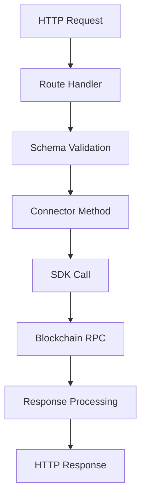

Directory structure:
└── gateway/
    ├── chains.md
    ├── configuration.md
    ├── connectors.md
    ├── index.md
    ├── installation.md
    └── strategies.md


Files Content:

================================================
FILE: docs/gateway/chains.md
================================================
Gateway provides standardized access to multiple blockchain networks, enabling wallet management, transaction execution, and node RPC interactions. Each chain integration is customized to handle the specific requirements and features of that blockchain.

## Supported Chains

Gateway currently supports two major blockchain architectures:

| Base Chain | Architecture | Networks | Description |
|------------|--------------|----------|-------------|
| **Ethereum** | EVM | mainnet, arbitrum, optimism, base, sepolia, bsc, avalanche, celo, polygon | Ethereum and EVM-compatible chains |
| **Solana** | SVM | mainnet-beta, devnet | Solana and SVM-compatible chains |

## Ethereum

Gateway's Ethereum integration supports the Ethereum mainnet and all EVM-compatible Layer 1 and Layer 2 blockchains as **networks**. These networks share the same basic architecture, allowing for unified handling of wallets, transactions, and smart contract interactions.

### Ethereum Mainnet

- **Network ID:** mainnet
- **Chain ID:** 1
- **Native Token:** ETH

### Arbitrum

- **Network ID:** arbitrum
- **Chain ID:** 42161
- **Native Token:** ETH

### Optimism

- **Network ID:** optimism
- **Chain ID:** 10
- **Native Token:** ETH

### Base
- **Network ID:** base
- **Chain ID:** 8453
- **Native Token:** ETH

### Polygon
- **Network ID:** polygon
- **Chain ID:** 137
- **Native Token:** MATIC

### Binance Smart Chain (BSC)

- **Network ID:** bsc
- **Chain ID:** 56
- **Native Token:** BNB

### Avalanche C-Chain

- **Network ID:** avalanche
- **Chain ID:** 43114
- **Native Token:** AVAX

### Celo

- **Network ID:** celo
- **Chain ID:** 42220
- **Native Token:** CELO

### Sepolia (Testnet)

- **Network ID:** sepolia
- **Chain ID:** 11155111
- **Native Token:** ETH

### Chain Configuration

Each chain and network can be configured in Gateway through YAML configuration files:

- Template: `/src/templates/chains/ethereum.yml`
- User Configs Location: `/conf/chains/ethereum.yml`

```yaml
defaultNetwork: mainnet
defaultWallet: '<ethereum-wallet-address>'
```

### Network Configuration

- Template: `/src/templates/chains/ethereum.yml`
- User Configs : `/conf/chains/ethereum/mainnet.yml`

```yaml
chainID: 1
nodeURL: https://eth.llamarpc.com
nativeCurrencySymbol: ETH
minGasPrice: 0.1
```

### API Endpoints

All EVM chains share the same API structure:

- `GET /chains/ethereum/status` - Chain connection and block status
- `GET /chains/ethereum/tokens` - Token information
- `POST /chains/ethereum/balances` - Wallet balances
- `POST /chains/ethereum/allowances` - Token allowances
- `POST /chains/ethereum/approve` - Approve token spending
- `POST /chains/ethereum/wrap` - Wrap native token
- `POST /chains/ethereum/unwrap` - Unwrap to native token
- `POST /chains/ethereum/poll` - Poll transaction status
- `POST /chains/ethereum/estimate-gas` - Estimate transaction gas

## Solana

Gateway's Solana integration provides access to the Solana blockchain and other networks that utilize the Solana Virtual Machine.

### Mainnet Beta

- **Network ID:** mainnet-beta
- **Native Token:** SOL

### Devnet (Testnet)

- **Network ID:** devnet
- **Native Token:** SOL

### Chain Configuration

Each chain and network can be configured in Gateway through YAML configuration files:

- Template: `/src/templates/chains/solana.yml`
- User Configs Location: `/conf/chains/solana.yml`

```yaml
defaultNetwork: mainnet-beta
defaultWallet: '<solana-wallet-address>'
```

### Network Configuration

- Template: `/src/templates/chains/solana.yml`
- User Configs: `/conf/chains/solana/mainnet-beta.yml`

```yaml
nodeURL: "https://api.mainnet-beta.solana.com"
commitment: "confirmed"
skipPreflight: false
preflightCommitment: "confirmed"
maxFee: 0.01
priorityFee: 0.00001
```

### API Endpoints

All Solana networks share the same API structure:

- `GET /chains/solana/status` - Chain connection and slot status
- `GET /chains/solana/tokens` - SPL token information
- `POST /chains/solana/balances` - Wallet SOL and token balances
- `POST /chains/solana/poll` - Poll transaction status
- `POST /chains/solana/estimate-gas` - Estimate transaction fees

## Chain Schema

Gateway implements a standardized schema for chain operations across all supported blockchains. These schemas define the structure of requests and responses for common blockchain operations.

### Status Check
Returns chain connection status and current block/slot information.

**Request Schema:**
```json
{
  "network": "string (optional)" // Network identifier (e.g., "mainnet", "mainnet-beta")
}
```

**Response Schema:**
```json
{
  "chain": "string",           // Chain name (e.g., "ethereum", "solana")
  "network": "string",         // Network identifier
  "rpcUrl": "string",          // Current RPC endpoint
  "currentBlockNumber": 12345, // Current block number or slot
  "nativeCurrency": "string"   // Native token symbol (e.g., "ETH", "SOL")
}
```

### Token Information
Retrieves token metadata including addresses and decimals.

**Request Schema:**
```json
{
  "network": "string (optional)",           // Network identifier
  "tokenSymbols": "string | string[] (optional)" // Single symbol or array of symbols/addresses
}
```

**Response Schema:**
```json
{
  "tokens": [
    {
      "symbol": "string",   // Token symbol
      "address": "string",  // Token contract address
      "decimals": 6,        // Token decimals
      "name": "string"      // Token full name
    }
  ]
}
```

### Balance Query
Fetches wallet balances for native and specified tokens.

**Request Schema:**
```json
{
  "network": "string (optional)",      // Network identifier
  "address": "string (optional)",      // Wallet address to query
  "tokens": ["string"] (optional)",    // Array of token symbols or addresses
  "fetchAll": false                    // Fetch all tokens in wallet, not just those in token list
}
```

**Response Schema:**
```json
{
  "balances": {
    "TOKEN_SYMBOL": 1234.56  // Token symbol/address as key, balance as number
  }
}
```

### Transaction Polling
Polls the status of a submitted transaction.

**Request Schema:**
```json
{
  "network": "string (optional)",         // Network identifier
  "signature": "string",                  // Transaction signature/hash
  "tokens": ["string"] (optional)",       // Token symbols/addresses for balance change calculation
  "walletAddress": "string (optional)"    // Wallet address for balance change calculation
}
```

**Response Schema:**
```json
{
  "currentBlock": 12345,              // Current block number
  "signature": "string",              // Transaction signature
  "txBlock": 12340 | null,            // Block where transaction was included
  "txStatus": 0 | 1 | -1,             // 0=PENDING, 1=CONFIRMED, -1=FAILED
  "fee": 0.001 | null,                // Transaction fee paid
  "tokenBalanceChanges": {            // Optional: token balance changes
    "TOKEN": 100.5                    // Change amount for each token
  },
  "txData": {} | null,                // Additional transaction data
  "error": "string (optional)"        // Error message if failed
}
```

### Gas/Fee Estimation
Estimates transaction fees for the network.

**Request Schema:**
```json
{
  "network": "string (optional)"  // Network identifier
}
```

**Response Schema:**
```json
{
  "feePerComputeUnit": 0.000001,  // Fee per compute unit or gas unit
  "denomination": "string",       // Unit denomination ("lamports" for Solana, "gwei" for Ethereum)
  "computeUnits": 200000,          // Default compute units/gas limit used for calculation
  "feeAsset": "string",            // Native currency symbol (ETH, SOL, etc.)
  "fee": 0.002,                    // Total estimated fee using default limits
  "timestamp": 1234567890          // Unix timestamp of estimate
}
```

### Transaction Status Enum
All chains use a standardized transaction status enum:

- `0` = **PENDING**: Transaction submitted but not yet confirmed
- `1` = **CONFIRMED**: Transaction successfully confirmed on-chain
- `-1` = **FAILED**: Transaction failed or was rejected

## Adding New Networks

Gateway's modular architecture makes it easy to add support for new EVM- and SVM-based blockchain networks.

1. **Create network configuration file:**
   ```yaml
   # /conf/chains/ethereum/mynetwork.yml
   nodeURL: "https://rpc.mynetwork.com"
   chainId: 12345
   nativeCurrencySymbol: "MYT"
   minGasPrice: 0.1
   ```

2. **Add token list:**
Create `/conf/tokens/ethereum/mynetwork.json` with supported tokens

3. **Update connectors**
Update each supported connector's configuration file (i.e. `uniswap.config.ts`) to include the new network


================================================
FILE: docs/gateway/configuration.md
================================================
Gateway uses a modular configuration system that allows you to customize various aspects of its operation. This guide explains the configuration structure and how to modify it to suit your needs.

## Configuration Overview

Gateway's configuration system consists of YAML files located in the `/conf` directory, along with JSON files for tokens and pools organized by chain and connector.

The initial configuration files are created automatically using the default templates in `/src/templates` when you run the setup script during [installation](./installation.md).

### Configuration Structure

The `/conf/` folder contains the following types of configuration files:

1. **Root Configuration** (`root.yml`): Defines the list of all configuration files and their schemas
2. **Server Configuration** (`server.yml`): Controls Gateway server behavior
3. **Chain Configurations** (e.g., `solana.yml`): Define blockchain network settings
4. **Connector Configurations** (e.g., `raydium.yml`): Configure DEX-specific settings
5. **Token Lists** (`/conf/tokens/{chain}/{network}.json`): Token definitions for each network
6. **Pool Lists** (`/conf/pools/{connector}.json`): Liquidity pool definitions for each DEX connector

### Root Configuration

The `root.yml` file serves as the entry point for Gateway's configuration system. It defines which configuration files are loaded and their corresponding schema files.

```yaml
version: 3
configurations:
  $namespace server:
    configurationPath: server.yml
    schemaPath: server-schema.json

  $namespace solana:
    configurationPath: solana.yml
    schemaPath: solana-schema.json

  $namespace jupiter:
    configurationPath: jupiter.yml
    schemaPath: jupiter-schema.json
```

This file tells Gateway:

- Which configuration files to load
- Where to find the schema files that validate each configuration, which are located in the `/src/services/schemas` directory
- How to namespace each configuration section

### Server Configuration

The `server.yml` file controls the core Gateway server behavior, including ports, logging, and security settings.

```yaml
# GMT Offset in hours (e.g. -8 for Pacific US Time, -5 for Eastern US Time)
GMTOffset: -8

# Port on which to run the Gateway server
port: 15888

# Port on which to run the Swagger documentation UI.
# Set to 0 to serve docs at http://0.0.0.0:{port}/docs (same port as Gateway server)
# Set to a specific port (e.g. 8080) to serve docs separately at http://0.0.0.0:{docPort}
docsPort: 0

# Path to folder where Hummingbot generates self-signed certificates
certificatePath: ./certs/

# Path to folder where logs will be stored.
logPath: './logs'

# IPs allowed to access gateway. localhost is allowed by default.
ipWhitelist: []

# If true, logs will be stored in logPath and printed to stdout. If false, they
# will only be stored in logPath and not printed to stdout.
logToStdOut: true

# If true, the server will print detailed Fastify logs for each request and response to stdout. If false, only standard logs will be emitted.
fastifyLogs: false

# Nonce database
nonceDbPath: 'nonce.level'

# Transaction database
transactionDbPath: 'transaction.level'
```

### Chain Configuration

Chain configuration files (e.g., `/conf/chains/solana.yml`) now contain only the default network and wallet settings for each blockchain.

```yaml
defaultNetwork: mainnet-beta
defaultWallet: '<solana-wallet-address>'
```

When you connect a wallet using `gateway connect`, it automatically becomes the `defaultWallet` for that chain. The `defaultNetwork` determines which network configuration Gateway uses by default for that chain.

!!! note
    Network-specific configurations are now stored in separate files under `/conf/chains/{chain}/{network}.yml`


### Connector Configuration

Connector configuration files (e.g., `/conf/connectors/jupiter.yml`) define settings specific to each DEX connector, including slippage tolerance, routing preferences, and API configurations.

#### Example: Jupiter Configuration

```yaml
# Default slippage percentage for swaps (as a decimal, e.g., 1 = 1%)
slippagePct: 1

# Priority level for swap transaction processing
# Options: medium, high, veryHigh
priorityLevel: 'veryHigh'

# Maximum priority fee in lamports (for dynamic priority fees)
# Used when priorityLevel is set and no explicit priorityFeeLamports is provided
maxLamports: 1000000

# Restrict routing to only go through 1 market
# Default: false (allows multi-hop routes for better prices)
onlyDirectRoutes: false

# Restrict routing through highly liquid intermediate tokens only
# Default: true (for better price and stability)
restrictIntermediateTokens: true

# Jupiter API key (optional)
# For free tier, leave empty (uses https://lite-api.jup.ag)
# For paid plans, generate key at https://portal.jup.ag (uses https://api.jup.ag)
apiKey: ''
```

**Configuration Options Explained:**

- **`slippagePct`**: Maximum acceptable price slippage for trades. If the execution price deviates more than this percentage from the quoted price, the transaction will fail.

- **`priorityLevel`**: Controls transaction priority on Solana. Higher priority levels result in faster confirmation but cost more in fees. Set to `veryHigh` for time-sensitive trades.

- **`maxLamports`**: Caps the maximum priority fee to prevent excessive costs during network congestion. 1,000,000 lamports = 0.001 SOL.

- **`onlyDirectRoutes`**: When `true`, restricts swaps to direct pools only (no intermediate tokens). This can reduce price impact but may result in worse pricing or failed routes for less liquid pairs.

- **`restrictIntermediateTokens`**: When `true`, only routes through major tokens (SOL, USDC, USDT) as intermediates. This increases reliability and reduces price impact risks.

- **`apiKey`**: Optional API key for Jupiter's paid tier. The free tier (lite-api) is suitable for most users, while the paid tier offers higher rate limits and additional features.

### Network Configuration

Network configuration files (e.g., `/conf/chains/solana/mainnet-beta.yml`) contain the detailed settings for each blockchain network, including RPC endpoints and transaction parameters.

#### Example: Solana mainnet-beta Configuration

```yaml
nodeURL: https://api.mainnet-beta.solana.com
nativeCurrencySymbol: SOL

# Default compute units for a transaction
# This sets the compute unit limit for transactions when not specified by the user
defaultComputeUnits: 200000

# Confirmation polling interval in seconds
# How often to check if a submitted transaction has been confirmed (inner retry loop)
confirmRetryInterval: 0.5

# Number of confirmation polling attempts
# How many times to poll for confirmation before considering the transaction unconfirmed
confirmRetryCount: 10

# Floor percentile of recent priority fee samples used to estimate gasPrice for a transaction
# Use the Nth percentile of recent priority fees as the base fee (90 = 90th percentile)
basePriorityFeePct: 90

# Minimum priority fee per compute unit in lamports
# This sets the floor for priority fees to ensure transactions are processed (default: 0.1 lamports/CU)
minPriorityFeePerCU: 0.1
```

You can view the current configuration for any network using Gateway commands:

```
>>> gateway config solana-mainnet-beta

Gateway Configuration - namespace: solana-mainnet-beta:
nodeURL: https://dry-dawn-hill.solana-mainnet.quiknode.pro/41bbd7ad405c552f91cc928e044e5e04c66341d2
nativeCurrencySymbol: SOL
defaultComputeUnits: 200000
confirmRetryInterval: 0.5
confirmRetryCount: 10
basePriorityFeePct: 90
minPriorityFeePerCU: 0.1
```

To update any network setting, use `gateway config [namespace] update`:

```
>>> gateway config solana-mainnet-beta update

Available configuration paths: nodeURL, nativeCurrencySymbol, defaultComputeUnits, confirmRetryInterval, confirmRetryCount, basePriorityFeePct, minPriorityFeePerCU

Enter configuration path (or 'exit' to cancel): nodeURL
Current value for 'nodeURL': https://api.mainnet-beta.solana.com
Enter new value (or 'exit' to cancel): https://your-preferred-node-provider.com/your-api-key
```

## Common Configuration Tasks

### Changing Node Providers

To change the RPC node provider for a blockchain network, you can either use Gateway commands or edit the configuration files directly.

#### Using Gateway Commands

```
>>> gateway config solana-mainnet-beta update

Current configuration for solana-mainnet-beta:
nodeURL: https://api.mainnet-beta.solana.com
nativeCurrencySymbol: SOL
defaultComputeUnits: 200000
confirmRetryInterval: 0.5
confirmRetryCount: 10
basePriorityFeePct: 90
minPriorityFeePerCU: 0.1

Available configuration paths: nodeURL, nativeCurrencySymbol, defaultComputeUnits, confirmRetryInterval, confirmRetryCount, basePriorityFeePct, minPriorityFeePerCU

Enter configuration path (or 'exit' to cancel): nodeURL
Current value for 'nodeURL': https://api.mainnet-beta.solana.com
Enter new value (or 'exit' to cancel): https://your-preferred-node-provider.com/your-api-key

Successfully updated nodeURL
Gateway will restart automatically for changes to take effect
```

#### Editing Configuration Files

1. Navigate to the network configuration folder (e.g., `/conf/chains/solana/`)
2. Open the specific network file (e.g., `mainnet-beta.yml`)
3. Locate the `nodeURL` field and replace it with your preferred node provider's URL
4. Save the file and restart Gateway

Example for Solana mainnet (`/conf/chains/solana/mainnet-beta.yml`):
```yaml
nodeURL: https://your-preferred-node-provider.com/your-api-key
nativeCurrencySymbol: SOL

# Default compute units for a transaction
# This sets the compute unit limit for transactions when not specified by the user
defaultComputeUnits: 200000

# Confirmation polling interval in seconds
# How often to check if a submitted transaction has been confirmed (inner retry loop)
confirmRetryInterval: 0.5

# Number of confirmation polling attempts
# How many times to poll for confirmation before considering the transaction unconfirmed
confirmRetryCount: 10

# Floor percentile of recent priority fee samples used to estimate gasPrice for a transaction
# Use the Nth percentile of recent priority fees as the base fee (90 = 90th percentile)
basePriorityFeePct: 90

# Minimum priority fee per compute unit in lamports
# This sets the floor for priority fees to ensure transactions are processed (default: 0.1 lamports/CU)
minPriorityFeePerCU: 0.1
```

Example for Ethereum mainnet (`/conf/chains/ethereum/mainnet.yml`):
```yaml
chainID: 1
nodeURL: https://your-preferred-node-provider.com/your-api-key
nativeCurrencySymbol: ETH
minGasPrice: 0.1
```

### Adding Tokens

!!! tip
    The new Gateway endpoints accept addresses for `baseToken` and `quoteToken` in addition to symbols, so you should be able to use addresses directly before adding their symbols into the network's token list.

Gateway uses standardized token lists organized by chain and network. Each network has its own token list file that contains metadata for all supported tokens on that network.

#### Using Gateway Commands

```
>>  gateway token HERMES update

  Enter chain (e.g., ethereum, solana): solana

  Token 'HERMES' not found. Let's add it to solana (mainnet-beta).

  Enter token information:

  Symbol [HERMES]:

  Name: HermesWizard

  Contract address: 24R8j15RDq3VoeRaSDFXMvSw4W7RLLZLdpTwK8ynx777

  Decimals [18]: 9

  Token to add/update:
  {
    "symbol": "HERMES",
    "name": "HermesWizard",
    "address": "24R8j15RDq3VoeRaSDFXMvSw4W7RLLZLdpTwK8ynx777",
    "decimals": 9
  }

  Add/update this token? (Yes/No) >>> Yes

  Adding/updating token...
  ✓ Token successfully added/updated!

  Restarting Gateway for changes to take effect...
  ✓ Gateway restarted successfully

  You can now use 'gateway token HERMES' to view the token information.
```

#### Editing Token Files

1. Navigate to the `/conf/tokens/{chain}/` folder (e.g., `/conf/tokens/solana/`)
2. Open the appropriate network file (e.g., `mainnet-beta.json` for Solana mainnet)
3. Add a new token entry to the array following the existing format below
4. Make sure that the resulting file is still valid JSON!
5. Save the file and restart Gateway

```json
{
  "chainId": 101,
  "name": "ai16z",
  "symbol": "AI16Z",
  "address": "HeLp6NuQkmYB4pYWo2zYs22mESHXPQYzXbB8n4V98jwC",
  "decimals": 9
}
```

The token list structure follows the [Token Lists](https://tokenlists.org/) standard, which helps users avoid scams and find legitimate tokens across different networks.

### Adding Pools

Each AMM and CLMM DEX may have different pools for the same trading pair, with varying parameters like fee tier and bin step. Gateway now stores pool definitions in dedicated JSON files for each DEX connector.

#### Using Gateway Commands

```
>>>  gateway pool raydium/amm LIGHT-SOL update

  === Add Pool for LIGHT-SOL on raydium/amm ===
  Chain: solana
  Network: mainnet-beta

  Pool 'LIGHT-SOL' not found. Let's add it to solana (mainnet-beta).

  Enter pool information:

  Pool contract address: 7YZEyZ3DuHQTmgmKwzuXMYG6SHD3sCWZ3mLkU7HuLrfC

  Pool to add:
  {
    "address": "7YZEyZ3DuHQTmgmKwzuXMYG6SHD3sCWZ3mLkU7HuLrfC",
    "baseSymbol": "LIGHT",
    "quoteSymbol": "SOL",
    "type": "amm"
  }

  Add this pool? (Yes/No) >>> Yes

  Adding pool...
  ✓ Pool successfully added!

  Restarting Gateway for changes to take effect...
  ✓ Gateway restarted successfully

  Pool has been added. You can view it with: gateway pool raydium/amm LIGHT-SOL
```

#### Editing Pool Files

1. Navigate to the `/conf/pools/` folder
2. Open the connector's pool file (e.g., `raydium.json`)
3. Add a new pool entry to the array following the existing format
4. Make sure that the resulting file is still valid JSON!
5. Save the file and restart Gateway

Example pool entry:
```json
{
  "type": "amm",
  "network": "mainnet-beta",
  "baseSymbol": "WIF",
  "quoteSymbol": "SOL",
  "address": "EP2ib6dYdEeqD8MfE2ezHCxX3kP3K2eLKkirfPm5eyMx"
}
```

For CLMM pools, use `"type": "clmm"` instead. The pool file structure allows you to specify different pools for different networks and trading types (AMM vs CLMM) within the same connector.

### Updating Configurations

There are two ways to update your Gateway configurations:

1. **Manual Update**:
   - Edit the configuration files directly
   - Restart Gateway to apply changes

2. **API Update**:
   - Use the `/config/update` API endpoint to update configurations
   - This allows for dynamic updates without restarting Gateway

!!! tip
    Always validate your configuration changes before applying them to a production environment. You can use the schema files referenced in `root.yml` to ensure your configurations are valid.


================================================
FILE: docs/gateway/connectors.md
================================================
# Gateway DEX Connectors

Gateway provides standardized connectors for interacting with decentralized exchanges (DEXs) across different blockchain networks. Each connector implements one or more trading types (Router, AMM, CLMM) to support various DeFi protocols.

## Supported Connectors

!!! note
    The Gateway refactoring approved in [NCP-22](https://snapshot.box/#/s:hbot-ncp.eth/proposal/0x5cc3540ee219787d5c842bc1ccdb11aab46203bb7f0be658b6b40858501a8e4c) has been completed with the v2.8.0 release. The new standard is now ready, and developers can help upgrade the legacy connectors to the new architecture. Community developers can claim bounties for these upgrades where available.

### Active Connectors

| Protocol | Chain | Router | AMM | CLMM | Description |
|----------|-------|--------|-----|------|---------------|
| **[Jupiter](/exchanges/gateway/jupiter)** | Solana | ✅ | ❌ | ❌ | Leading DEX aggregator on Solana |
| **[Meteora](/exchanges/gateway/meteora)** | Solana | ❌ | ❌ | ✅ | Dynamic Liquidity Market Maker (DLMM) |
| **[Raydium](/exchanges/gateway/raydium)** | Solana | ❌ | ✅ | ✅ | Full-featured DEX with AMM and CLMM |
| **[Uniswap](/exchanges/gateway/uniswap)** | Ethereum/EVM | ✅ | ✅ | ✅ | The original AMM DEX with V2, V3, and Universal Router |

### Legacy Connectors

The following connectors are available in legacy versions but need to be upgraded to the v2.8.0 standard:

| Protocol | Chain | Router | AMM | CLMM | Bounty |
|----------|-------|--------|-----|------|--------|
| **[PancakeSwap](/exchanges/gateway/pancakeswap)** | BNB Chain | ✅ | ✅ | ✅ | [#7654](https://github.com/hummingbot/hummingbot/issues/7654) |
| **[Balancer](/exchanges/gateway/balancer)** | Ethereum/EVM | ❌ | ✅ | ❌ | [#7653](https://github.com/hummingbot/hummingbot/issues/7653) |
| **[Curve](/exchanges/gateway/curve)** | Ethereum/EVM | ❌ | ✅ | ❌ | [#7652](https://github.com/hummingbot/hummingbot/issues/7652) |
| **[SushiSwap](/exchanges/gateway/sushiswap)** | Ethereum/EVM | ✅ | ✅ | ✅ | - |
| **[QuickSwap](/exchanges/gateway/quickswap)** | Polygon | ❌ | ✅ | ✅ | - |
| **[TraderJoe](/exchanges/gateway/traderjoe)** | Avalanche | ❌ | ✅ | ✅ | - |
| **[ETCSwap](/exchanges/gateway/etcSwap)** | Ethereum Classic | ❌ | ✅ | ✅ | - |


## Connector Schemas

Gateway implements three standardized schemas that define the API structure for different trading types. Each connector must implement one or more of these schemas to ensure compatibility with Hummingbot.

### Router Schema
For DEX aggregators and swap-only protocols. Focuses on quoting optimal trade routes across multiple liquidity sources and executing quotes.

**Key Endpoints:**

- `quote-swap`: Get optimal swap quote with routing details
- `execute-swap`: Execute swap directly
- `execute-quote`: Execute pre-fetched quote

### AMM Schema
For traditional Automated Market Maker pools with constant product (x*y=k) formulas, such as Uniswap V2 and Raydium Standard Pools.

**Key Endpoints:**

- `pool-info`: Get pool reserves and pricing
- `position-info`: Get current liquidity position details
- `quote-liquidity`: Calculate liquidity provision amounts
- `add-liquidity`: Add liquidity to pool
- `remove-liquidity`: Remove liquidity from pool

### CLMM Schema
For Concentrated Liquidity Market Maker pools where liquidity providers can specify custom price ranges such as Uniswap V3 and Raydium Concentrated Pools.

**Key Endpoints:**

- `positions-owned`: List all positions for an address
- `quote-position`: Calculate position parameters for price range
- `open-position`: Create new concentrated liquidity position
- `add-liquidity`: Add liquidity to existing position
- `remove-liquidity`: Remove liquidity from position
- `collect-fees`: Collect earned fees
- `close-position`: Close position and withdraw all liquidity

## Building Custom Connectors

For detailed instructions on building custom Gateway DEX connectors, see [Building Gateway Connectors](/developers/gateway-connectors/).


================================================
FILE: docs/gateway/index.md
================================================
# Hummingbot Gateway

## What is Gateway?

Hummingbot Gateway is a Typescript-based API server that standardizes interactions with blockchain networks and decentralized exchanges (DEXs). It acts as a middleware layer, providing a unified interface for performing actions like checking balances, executing trades, and managing wallets across different protocols.

Gateway is a companion service to the Python-based [Hummingbot client](https://github.com/hummingbot/hummingbot), exposing standardized REST API endpoints for trading and liquidity-related functionality on DEXs. This enables Hummingbot to run strategies that operate across both centralized (CEX) and decentralized exchanges seamlessly.

## In This Section

- **[Installation & Setup](installation.md)**: Complete installation guide for source and Docker
- **[Configuration](configuration.md)**: How to configure chains, connectors, and settings
- **[Commands](commands.md)**: Comprehensive reference of all Gateway-related Hummingbot commands
- **[Chains](chains.md)**: Detailed information about supported chains
- **[DEX Connectors](connectors.md)**: Guide to all supported DEX in Gateway
- **[Strategies & Scripts](strategies.md)**: Using Gateway with Hummingbot strategies

## Key Features

- **Standardized REST API**: Consistent endpoints for interacting with blockchains (Ethereum, Solana) and DEXs
- **DEX SDK Integration**: Interfaces with TypeScript/JavaScript DEX SDKs to provide standardized endpoints across different protocols
- **Connector Sub-Types**: Router (DEX aggregators), AMM (V2-style pools), and CLMM (V3-style concentrated liquidity)
- **Modular Architecture**: Clear separation of concerns with distinct modules for chains, connectors, configuration, and wallet management
- **Hardware Wallet Support**: Built-in support for hardware wallets and encrypted storage for regular wallets
- **Extensible**: Easily extended with new chains and connectors

## Supported Chains and Networks

| Chain Architecture | Networks | Description |
|-------|----------|-------------|
| **Ethereum** | mainnet, arbitrum, optimism, base, sepolia, bsc, avalanche, celo, polygon | Ethereum and EVM-compatible chains |
| **Solana** | mainnet-beta, devnet | Solana and SVM-compatible chains |

## Supported DEXs

| Protocol | Chain | Router | AMM | CLMM | Description |
|----------|-------|--------|-----|------|-------------|
| **Jupiter** | Solana | ✅ | ❌ | ❌ | Leading DEX aggregator on Solana |
| **Meteora** | Solana | ❌ | ❌ | ✅ | Dynamic Liquidity Market Maker (DLMM) |
| **Raydium** | Solana | ❌ | ✅ | ✅ | Full-featured DEX with V2 AMM and V3 CLMM |
| **Uniswap** | Ethereum/EVM | ✅ | ✅ | ✅ | Complete V2, V3, and Smart Order Router |
| **0x** | Ethereum/EVM | ✅ | ❌ | ❌ | Professional DEX aggregator with RFQ system |

### Connector Schemas

- **Router**: DEX aggregators that find optimal swap routes across multiple liquidity sources, maximizing execution quality by splitting trades across multiple pools and protocols
- **AMM** (Automated Market Maker): Traditional V2-style constant product pools using the x*y=k formula, where liquidity is distributed uniformly across the entire price range, making it simpler but less capital efficient
- **CLMM** (Concentrated Liquidity Market Maker): V3-style pools that allow liquidity providers to concentrate their capital within custom price ranges, dramatically improving capital efficiency and enabling better pricing for traders

For detailed implementation guides and examples for each schema, see [DEX Connectors](connectors.md).

## Installation

Gateway can be installed alongside [Hummingbot](https://github.com/hummingbot/hummingbot) to enable trading on AMM DEXs, or as a standalone API server. For detailed installation instructions, see [Installation & Setup](installation.md).

When running Gateway in `DEV` mode, access the interactive Swagger API documentation at: <http://localhost:15888/docs>

## Architecture

Gateway follows a modular architecture with clear separation of concerns:

```
/src
├── chains/               # Blockchain-specific implementations
│   └── {chain}/         # Each blockchain (ethereum, solana, etc.)
├── connectors/           # DEX-specific implementations
│   ├── {dex}/           # Each DEX connector directory
│   │   ├── router-routes/   # DEX aggregator operations
│   │   ├── amm-routes/      # AMM pool operations
│   │   └── clmm-routes/     # Concentrated liquidity operations
├── services/             # Core services (config, logging, tokens)
├── schemas/              # API request/response schemas
├── templates/            # Base classes and interfaces for connectors
├── tokens/               # Token lists and metadata
├── pools/                # Liquidity pool configurations
└── wallet/               # Wallet management
```

## Governance and Maintenance

Like other connectors, Gateway DEX connectors require ongoing maintenance: fixing bugs, addressing user issues, and keeping up with updates to both the exchange/blockchain API as well as improvements to the Hummingbot connector standard.

Hummingbot Foundation maintains certain reference connectors as the standard and utilizes a community-based maintenance process. We assign [Bounties](/bounties) to community developers to upgrade and fix bugs for each exchange's connectors in the codebase.

Each quarter, [Exchange Connector Polls](/governance/polls) allocates HBOT bounties toward the top CEX connectors and determines which exchange connectors should be included in the codebase going forward. This process also determines which blockchains and networks that Gateway supports.

See the **Connector Pots** tab in [HBOT Tracker](https://docs.google.com/spreadsheets/d/1UNAumPMnXfsghAAXrfKkPGRH9QlC8k7Cu1FGQVL1t0M/edit?usp=sharing) for the current allocations for each exchange.

## Contributing

Gateway is part of the open source Hummingbot project. Ways to contribute:

- **Build new connectors**: See [DEX Connectors](/developers/gateway-connectors/) for implementation guide
- **File issues**: Report bugs at [GitHub Issues](https://github.com/hummingbot/gateway/issues)
- **Submit pull requests**: Contribute code at [GitHub](https://github.com/hummingbot/gateway/pulls)
- **Edit documentation**: Improve docs at [GitHub](https://github.com/hummingbot/hummingbot-site/)
- **Vote in polls**: Participate in [polls](https://snapshot.org/#/hbot.eth) to vote on which DEXs are supported

## History

For more information about Gateway's history and architecture decisions, see:

* [Hummingbot Gateway V2 Architecture - Part 1](/blog/hummingbot-gateway-architecture---part-1/)
* [Hummingbot Gateway V2 Architecture - Part 2](/blog/hummingbot-gateway-architecture---part-2/)


================================================
FILE: docs/gateway/installation.md
================================================
Hummingbot Gateway is an API/CLI client that exposes standardized REST endpoints to interact with blockchain networks and decentralized exchanges (DEXs). It provides a language-agnostic approach to interacting with these protocols through a unified interface.

There are two main ways to install Gateway:

1. **Docker Installation** (Recommended for most users)
2. **Source Installation** (For developers and advanced users)

## Install with Docker

This assumes that you want to use Gateway alongside Hummingbot to enable DEX trading. The Docker process enables seamless communication between the two services.

1 - Navigate to your Hummingbot directory

2 - Edit `docker-compose.yml` and uncomment the Gateway-related lines:
```yaml
  gateway:
   restart: always
   container_name: gateway
   image: hummingbot/gateway:latest
   ports:
     - "15888:15888"
   volumes:
     - "./gateway-files/conf:/home/gateway/conf"
     - "./gateway-files/logs:/home/gateway/logs"
     - "./certs:/home/gateway/certs"
   environment:
     - GATEWAY_PASSPHRASE=admin
     - DEV=true
```

3 - Start both services
```bash
docker compose up -d

[+] Running 3/3
 ✔ Network hummingbot_default  Created                                                                                                                                              0.0s
 ✔ Container hummingbot        Started                                                                                                                                              0.2s
 ✔ Container gateway           Started
```

4 - Attach to Hummingbot
```
docker attach hummingbot
```

After setting your password, you should see `Gateway: 🟢 ONLINE` in the upper right corner.

!!! note
    By default, Gateway runs in development mode (`DEV=true`) which uses HTTP for easier setup. For production environments requiring HTTPS, set `DEV=false` and ensure certificates are properly configured.

## Install from Source

You can install Gateway on a standalone basis and then link it to Hummingbot manually. These instructions assume that you have already installed Hummingbot on the machine where you are installing Gateway, either from source or via Docker. See [Installation](/installation) for how to install Hummingbot.

### Install Prerequisites

Install the following dependencies:

- [NodeJS](https://nodejs.org/) (v20.0.0 or higher)
- [pnpm](https://pnpm.io/) package manager

!!! tip
    The new version of Gateway uses pnpm instead of npm because it efficiently handles dependencies with a disk space-saving approach. Since Gateway imports multiple libraries with redundant dependencies, pnpm creates a single content-addressable storage for all packages, significantly reducing installation size and improving performance.

From CLI:

First, install NodeJS 20+ using the `sudo` administrator prefix:
```bash
# For Ubuntu 20+
sudo apt update && sudo apt install -y curl
curl -fsSL https://deb.nodesource.com/setup_20.x | sudo -E bash -
sudo apt install -y nodejs
```

Afterwards, install pnpm:
```bash
sudo npm install -g pnpm
```

### Install and Setup Gateway

1. Clone the Gateway repo and navigate into the folder:
```bash
# Clone repository
git clone https://github.com/hummingbot/gateway.git
cd gateway
```

2. Install and build Javascript dependencies defined in `package.json`:
```bash
pnpm install
pnpm build
```

### Run Setup Script

The `gateway-setup.sh` script, located in the root Gateway directory, copies the default Gateway [configuration](./configuration.md) files from `/src/templates` to `/conf/` folder.

Run the script:
```bash
pnpm run setup
```

The script will prompt you to select which configurations to update:

- `server.yml` - Gateway server configuration
- `chains/` - Chain and network configurations
- `connectors/` - DEX connector configurations
- `tokens/` - Token lists for each chain/network
- `pools/` - Pool lists for each DEX connector

For a fresh installation, select all options. The script will preserve any existing wallet configurations and `defaultWallet` settings.

### Optional: Generate Certificates

!!! note
    Certificate generation is optional. By default, Gateway runs in development mode (HTTP) which doesn't require certificates. You only need certificates if you want to run Gateway in production mode (HTTPS).

If you want to enable HTTPS mode for secure communication:

1. Start your Hummingbot [client](/client) and run `gateway generate-certs`
2. Enter a secure passphrase when prompted
3. Note the **certs_path** where certificates are stored
4. When running `pnpm run setup`, choose to link certificates and provide the path

To connect Hummingbot to Gateway running in HTTPS mode, set `gateway_use_ssl: true` in Hummingbot's `conf_client.yml`.

## Running Gateway

### Development vs Production Modes

Gateway can run in one of two modes:

**Development Mode (HTTP)** - Default

   - Started with `--dev` flag or by default
   - Exposes HTTP (unencrypted) REST endpoints
   - Interactive Swagger docs at <http://localhost:15888/docs>
   - Shows 🔴 indicator in logs
   - Compatible with Hummingbot when `gateway_use_ssl: false` in `conf_client.yml`

**Production Mode (HTTPS)** - Optional

   - Started without `--dev` flag
   - Exposes HTTPS (encrypted) REST endpoints
   - Requires SSL certificates
   - Shows 🟢 indicator in logs
   - Compatible with Hummingbot when `gateway_use_ssl: true` in `conf_client.yml`

!!! note
    HTTPS is no longer required to connect to Hummingbot. By default, both Gateway and Hummingbot are configured to use HTTP for easier setup. You can change the `gateway_use_ssl` setting in Hummingbot's `conf_client.yml` to switch between HTTP and HTTPS modes.

### Development Mode (Default)

For development mode (HTTP), which is now the default and works with Hummingbot:
```bash
pnpm start --passphrase=<PASSPHRASE> --dev
```

Or simply:
```bash
pnpm start --passphrase=<PASSPHRASE>
```

The passphrase is required for endpoints that handle wallet operations.

If the server has started successfully, you should see:
```bash
bigint: Failed to load bindings, pure JS will be used (try npm run rebuild?)

╔██████╗  █████╗ ████████╗███████╗██╗    ██╗ █████╗ ██╗   ██╗
██╔════╝ ██╔══██╗╚══██╔══╝██╔════╝██║    ██║██╔══██╗╚██╗ ██╔╝
██║  ███╗███████║   ██║   █████╗  ██║ █╗ ██║███████║ ╚████╔╝
██║   ██║██╔══██║   ██║   ██╔══╝  ██║███╗██║██╔══██║  ╚██╔╝
╚██████╔╝██║  ██║   ██║   ███████╗╚███╔███╔╝██║  ██║   ██║
 ╚═════╝ ╚═╝  ╚═╝   ╚═╝   ╚══════╝ ╚══╝╚══╝ ╚═╝  ╚═╝   ╚═╝
2025-04-04 10:09:59 | info | 	⚡️ Gateway version 2.8.0 starting at http://localhost:15888
2025-04-04 10:09:59 | info | 	Checking for processes using port 15888...
2025-04-04 10:09:59 | info | 	No process found using port 15888
2025-04-04 10:09:59 | info | 	🔴 Running in development mode with (unsafe!) HTTP endpoints
2025-04-04 10:09:59 | info | 	Read token file from conf/lists/solana.json, content length: 619791
2025-04-04 10:09:59 | info | 	Parsed token count: 3859
2025-04-04 10:09:59 | info | 	Loaded 3859 tokens for mainnet-beta
2025-04-04 10:09:59 | info | 	📓 Documentation available at http://localhost:15888/docs
```

### Production Mode (Optional)

For production mode (HTTPS), which requires SSL certificates:

1. Ensure SSL certificates are properly configured (see "Optional: Generate Certificates" section above)
2. Set `gateway_use_ssl: true` in Hummingbot's `conf_client.yml`
3. Run Gateway without the `--dev` flag:

```bash
pnpm start --passphrase=<PASSPHRASE> --prod
```

If the server has started successfully, you should see:
```bash
bigint: Failed to load bindings, pure JS will be used (try npm run rebuild?)

╔██████╗  █████╗ ████████╗███████╗██╗    ██╗ █████╗ ██╗   ██╗
██╔════╝ ██╔══██╗╚══██╔══╝██╔════╝██║    ██║██╔══██╗╚██╗ ██╔╝
██║  ███╗███████║   ██║   █████╗  ██║ █╗ ██║███████║ ╚████╔╝
██║   ██║██╔══██║   ██║   ██╔══╝  ██║███╗██║██╔══██║  ╚██╔╝
╚██████╔╝██║  ██║   ██║   ███████╗╚███╔███╔╝██║  ██║   ██║
 ╚═════╝ ╚═╝  ╚═╝   ╚═╝   ╚══════╝ ╚══╝╚══╝ ╚═╝  ╚═╝   ╚═╝
2025-04-04 10:12:32 | info | 	⚡️ Gateway version 2.8.0 starting at https://localhost:15888
2025-04-04 10:12:32 | info | 	Checking for processes using port 15888...
2025-04-04 10:12:32 | info | 	No process found using port 15888
2025-04-04 10:12:32 | info | 	🟢 Running in secured mode with behind HTTPS endpoints
2025-04-04 10:12:33 | info | 	Read token file from conf/lists/solana.json, content length: 619791
2025-04-04 10:12:33 | info | 	Parsed token count: 3859
2025-04-04 10:12:33 | info | 	Loaded 3859 tokens for mainnet-beta
2025-04-04 10:12:33 | info | 	📓 Documentation available at https://localhost:15888/docs
```

### Connecting to Hummingbot

Once Gateway is running, go back to your Hummingbot client or restart it if you have exited. In the upper right corner, you should see **GATEWAY: 🟢 ONLINE** if your Hummingbot client is successfully connected to Gateway.

[](./legacy/gateway-status.png)

If you see **GATEWAY: OFFLINE**, check that:

1. Gateway is running on port 15888
2. The `gateway_use_ssl` setting in Hummingbot's `conf_client.yml` matches your Gateway mode (false for HTTP, true for HTTPS)
3. If using HTTPS, certificates are properly configured in both Gateway and Hummingbot


## Interactive Swagger Docs


Gateway provides interactive API documentation through Swagger UI when running in development mode. This interface allows you to:

1. Browse all available API endpoints
2. Test API calls directly from your browser
3. View request/response schemas
4. Execute live API calls

To access the Swagger documentation:

1. Start Gateway in development mode using `pnpm start --passphrase=<PASSPHRASE> --dev`
2. Open your browser and navigate to <http://localhost:15888/docs>
3. You'll see the Swagger UI interface with all available endpoints grouped by category

Each endpoint in the documentation displays detailed information (method, path, description, parameters, request/response examples) and allows you to test API calls directly by filling in parameters and viewing the server's response.

The documentation is automatically generated from the Gateway route files, ensuring it's always up to date with the latest API changes.


================================================
FILE: docs/gateway/strategies.md
================================================
Gateway enables sophisticated trading strategies on decentralized exchanges through Hummingbot. This page lists available Gateway-compatible strategies/scripts along with commonly used code snippets.

## Available Scripts and Strategies

The following table lists Gateway-compatible scripts and strategies available in the Hummingbot repository. All links point to the development branch where the latest versions are maintained.

| Name | Type | Description | Supported Schemas |
|------|------|-------------|-------------------|
| [AMM Data Feed Example](https://github.com/hummingbot/hummingbot/blob/development/scripts/amm_data_feed_example.py) | Script | Fetches real-time price data and monitors pool reserves from AMM pools | Router, AMM, CLMM |
| [AMM Trade Example](https://github.com/hummingbot/hummingbot/blob/development/scripts/amm_trade_example.py) | Script | Executes token swaps on AMM and CLMM pools with configurable parameters | Router, AMM, CLMM |
| [LP Manage Position](https://github.com/hummingbot/hummingbot/blob/development/scripts/lp_manage_position.py) | Script | Manages liquidity positions including adding, removing, and collecting fees | AMM, CLMM |
| [AMM Arbitrage](https://github.com/hummingbot/hummingbot/tree/development/hummingbot/strategy/amm_arb) | V1 Strategy | Arbitrage between CEX and DEX markets | Router, AMM, CLMMuter |
| [Cross Exchange Market Making](https://github.com/hummingbot/hummingbot/tree/development/hummingbot/strategy/cross_exchange_market_making) | V1 Strategy | Market making with Gateway connector as taker market | Router, AMM, CLMM |
| [Arbitrage Controller](https://github.com/hummingbot/hummingbot/blob/development/controllers/generic/arbitrage_controller.py) | V2 Controller | Creates ArbitrageExecutors between two markets | Router, AMM, CLMM |
| [XEMM Controller](https://github.com/hummingbot/hummingbot/blob/development/controllers/generic/xemm_controller.py) | V2 Controller | Creates XEMMExecutors between two markets | Router, AMM, CLMM |

## Code Snippets

The following code snippets demonstrate common Gateway operations in Hummingbot scripts and strategies.

### Data Feed

```python
amm_data_feed = AmmGatewayDataFeed(
            connector="jupiter/router",
            trading_pairs={"SOL-USDC","JUP-USDC"}
            order_amount_in_base=Decimal("1.0")
        )
```

### Connect Market

```python
@classmethod
def init_markets(cls):
        cls.markets = {"jupiter/router": {"SOL-USDC"}}

def __init__(self, connectors: Dict[str, ConnectorBase]):
        super().__init__(connectors)
```

### Get Price

```python
current_price = await self.connectors["jupiter/router"].get_quote_price(
                    trading_pair="SOL-USDC",
                    is_buy=True,
                    amount=Decimal("1.0"),
                )
```

### Get Balance
```python
connector = self.connectors["jupiter/router"]
await connector.update_balances(on_interval=False)
balance = connector.get_balance("SOL")
```

### Place Order

```python
connector = self.connectors["jupiter/router"]
order_id = connector.place_order(
                    is_buy=True,
                    trading_pair="SOL-USDC",
                    amount=Decimal("1.0"),
                    price=current_price,
                )
```

### Get LP Position Info

```python
position_info = await self.connectors["jupiter/router"].get_position_info(
                    trading_pair="SOL-USDC",
                    position_address="<position-address>"
                )
```

### Add Liquidity

```python
order_id = self.connectors["meteora/clmm"].add_liquidity(
                    trading_pair="SOL-USDC",
                    price=current_price,
                    upper_width_pct=10.0,
                    lower_width_pct=10.0,
                    base_token_amount=0.1,
                    quote_token_amount=20,
                )
```

### Remove Liquidity

```python
order_id = self.connectors["meteora/clmm"].remove_liquidity(
                    trading_pair="SOL-USDC",
                    position_address="<position-address>"
                )
```


-------------------------
-------------------------
-------------------------

Directory structure:
└── gateway-connectors/
    ├── architecture.md
    ├── index.md
    └── testing.md


Files Content:

================================================
FILE: docs/developers/gateway-connectors/architecture.md
================================================
# Gateway Connector Architecture

## Overview

Gateway connectors follow a standardized architecture that ensures consistency, maintainability, and compatibility with the Hummingbot client. This page describes the architectural patterns and design principles used in Gateway connectors.

## Core Components

### 1. Connector Class

The main connector class serves as the entry point and coordinator for all DEX operations:

```typescript
export class ConnectorBase {
  protected chain: string;
  protected network: string;
  protected config: ConnectorConfig;
  protected sdk: ProtocolSDK;

  constructor(chain: string, network: string) {
    this.chain = chain;
    this.network = network;
    this.config = this.loadConfig();
    this.sdk = this.initializeSDK();
  }
}
```

**Responsibilities:**
- SDK initialization and management
- Configuration loading
- Method coordination
- Error handling and recovery

### 2. Route Handlers

Route handlers translate HTTP requests into connector method calls:

```typescript
interface RouteHandler {
  validateRequest(req: Request): void;
  processRequest(req: Request): Promise<any>;
  formatResponse(data: any): Response;
  handleError(error: Error): ErrorResponse;
}
```

**Key Features:**
- Request validation against schemas
- Async operation handling
- Standardized response formatting
- Comprehensive error handling

### 3. Trading Types

Each trading type defines specific interfaces and operations:

#### Router Interface
```typescript
interface RouterConnector {
  quote(params: QuoteParams): Promise<Quote>;
  trade(params: TradeParams): Promise<Transaction>;
  estimateGas(params: TradeParams): Promise<BigNumber>;
  getRoute(params: RouteParams): Promise<Route[]>;
}
```

#### AMM Interface
```typescript
interface AMMConnector {
  poolInfo(pair: TradingPair): Promise<PoolInfo>;
  poolPrice(pair: TradingPair): Promise<Price>;
  addLiquidity(params: LiquidityParams): Promise<Transaction>;
  removeLiquidity(params: RemoveLiquidityParams): Promise<Transaction>;
  positionInfo(params: PositionParams): Promise<Position>;
}
```

#### CLMM Interface
```typescript
interface CLMMConnector {
  openPosition(params: OpenPositionParams): Promise<Position>;
  closePosition(positionId: string): Promise<Transaction>;
  addLiquidity(params: AddLiquidityParams): Promise<Transaction>;
  removeLiquidity(params: RemoveLiquidityParams): Promise<Transaction>;
  collectFees(positionId: string): Promise<Transaction>;
  getPositions(owner: string): Promise<Position[]>;
}
```

## Design Patterns

### Singleton Pattern

Connectors use the singleton pattern to ensure efficient resource usage:

```typescript
class MyDex {
  private static instances: Map<string, MyDex> = new Map();

  public static getInstance(chain: string, network: string): MyDex {
    const key = `${chain}:${network}`;
    if (!this.instances.has(key)) {
      this.instances.set(key, new MyDex(chain, network));
    }
    return this.instances.get(key)!;
  }
}
```

**Benefits:**
- Reuses SDK connections
- Maintains state consistency
- Reduces memory footprint
- Improves performance

### Factory Pattern

Token and pool creation uses factory patterns:

```typescript
class TokenFactory {
  static createToken(
    address: string,
    chain: string,
    network: string
  ): Token {
    const chainInstance = ChainFactory.getChain(chain, network);
    return new Token(address, chainInstance);
  }
}
```

### Strategy Pattern

Different swap strategies based on protocol type:

```typescript
interface SwapStrategy {
  execute(params: SwapParams): Promise<Transaction>;
}

class UniswapV2Strategy implements SwapStrategy {
  async execute(params: SwapParams): Promise<Transaction> {
    // V2 specific logic
  }
}

class UniswapV3Strategy implements SwapStrategy {
  async execute(params: SwapParams): Promise<Transaction> {
    // V3 specific logic
  }
}
```

## Data Flow

### Request Lifecycle



1. **Request Reception**: Gateway receives HTTP request
2. **Routing**: Request routed to appropriate handler
3. **Validation**: Request validated against schema
4. **Processing**: Connector method processes request
5. **Execution**: SDK executes blockchain operations
6. **Response**: Formatted response returned to client

### State Management

Gateway connectors maintain minimal state:

```typescript
class ConnectorState {
  // Cached data with TTL
  private poolCache: Map<string, CachedPool>;
  private tokenCache: Map<string, CachedToken>;

  // Active operations
  private pendingTransactions: Map<string, Transaction>;

  // Performance metrics
  private metrics: PerformanceMetrics;
}
```

**Cached Items:**
- Token metadata
- Pool information
- Gas estimates
- Route calculations

**TTL Strategy:**
- Token info: 1 hour
- Pool data: 30 seconds
- Gas prices: 10 seconds
- Routes: Quote TTL

## Error Handling

### Error Hierarchy

```typescript
class GatewayError extends Error {
  code: number;
  details: any;
}

class ValidationError extends GatewayError {
  code = 400;
}

class InsufficientLiquidityError extends GatewayError {
  code = 422;
}

class BlockchainError extends GatewayError {
  code = 503;
}
```

### Error Recovery

Connectors implement retry logic for transient failures:

```typescript
async function withRetry<T>(
  operation: () => Promise<T>,
  maxRetries: number = 3
): Promise<T> {
  let lastError: Error;

  for (let i = 0; i < maxRetries; i++) {
    try {
      return await operation();
    } catch (error) {
      lastError = error;
      if (!isRetryable(error)) throw error;
      await sleep(exponentialBackoff(i));
    }
  }

  throw lastError;
}
```

## Performance Optimization

### Batching

Batch multiple operations when possible:

```typescript
class BatchProcessor {
  private queue: Operation[] = [];
  private timer: NodeJS.Timeout;

  add(operation: Operation): void {
    this.queue.push(operation);
    this.scheduleFlush();
  }

  private async flush(): Promise<void> {
    const batch = this.queue.splice(0);
    await this.processBatch(batch);
  }
}
```

### Caching

Implement intelligent caching strategies:

```typescript
class Cache<T> {
  private data: Map<string, CacheEntry<T>> = new Map();

  get(key: string): T | undefined {
    const entry = this.data.get(key);
    if (!entry || this.isExpired(entry)) {
      return undefined;
    }
    return entry.value;
  }

  set(key: string, value: T, ttl: number): void {
    this.data.set(key, {
      value,
      expiry: Date.now() + ttl
    });
  }
}
```

### Connection Pooling

Maintain connection pools for blockchain RPCs:

```typescript
class RPCPool {
  private connections: RPCConnection[] = [];
  private currentIndex = 0;

  getConnection(): RPCConnection {
    const connection = this.connections[this.currentIndex];
    this.currentIndex = (this.currentIndex + 1) % this.connections.length;
    return connection;
  }
}
```

## Security Considerations

### Input Validation

All inputs must be validated:

```typescript
function validateAddress(address: string, chain: string): void {
  if (!isValidAddress(address, chain)) {
    throw new ValidationError('Invalid address format');
  }
}

function validateAmount(amount: string): BigNumber {
  const bn = BigNumber.from(amount);
  if (bn.lte(0)) {
    throw new ValidationError('Amount must be positive');
  }
  return bn;
}
```

### Private Key Handling

Never log or expose private keys:

```typescript
class WalletManager {
  private wallets: Map<string, Wallet> = new Map();

  addWallet(address: string, encryptedKey: string): void {
    const wallet = this.decryptWallet(encryptedKey);
    this.wallets.set(address, wallet);
    // Never log wallet or private key
  }
}
```

### Rate Limiting

Implement rate limiting for external calls:

```typescript
class RateLimiter {
  private calls: number[] = [];
  private limit: number;
  private window: number;

  async throttle(): Promise<void> {
    const now = Date.now();
    this.calls = this.calls.filter(t => t > now - this.window);

    if (this.calls.length >= this.limit) {
      const waitTime = this.calls[0] + this.window - now;
      await sleep(waitTime);
    }

    this.calls.push(now);
  }
}
```

## Testing Architecture

### Mock Framework

Create comprehensive mocks for testing:

```typescript
class MockSDK {
  async swap(params: SwapParams): Promise<MockTransaction> {
    return {
      hash: '0xmock...',
      gasUsed: BigNumber.from('100000'),
      status: 'success'
    };
  }
}
```

### Test Fixtures

Maintain test fixtures for common scenarios:

```typescript
export const fixtures = {
  tokens: {
    USDC: { address: '0x...', decimals: 6, symbol: 'USDC' },
    WETH: { address: '0x...', decimals: 18, symbol: 'WETH' }
  },
  pools: {
    USDC_WETH: { address: '0x...', fee: 3000 }
  }
};
```

## Best Practices

### 1. Separation of Concerns
- Keep business logic in connector class
- Route handlers only handle HTTP concerns
- Utils for pure functions

### 2. Dependency Injection
```typescript
class MyDex {
  constructor(
    private sdk: ISDK,
    private cache: ICache,
    private logger: ILogger
  ) {}
}
```

### 3. Immutability
```typescript
// Good
const newState = { ...oldState, updated: true };

// Avoid
oldState.updated = true;
```

### 4. Async/Await Consistency
```typescript
// Good
async function process(): Promise<Result> {
  const data = await fetchData();
  return transform(data);
}

// Avoid mixing patterns
function process(): Promise<Result> {
  return fetchData().then(transform);
}
```

### 5. Error Context
```typescript
try {
  await operation();
} catch (error) {
  throw new ConnectorError(
    'Operation failed',
    {
      originalError: error,
      context: { operation: 'swap', params }
    }
  );
}
```

## Resources

- [Gateway Architecture Overview](/gateway)
- [Schema Definitions](https://github.com/hummingbot/gateway/tree/development/src/schemas)
- [Example Implementations](https://github.com/hummingbot/gateway/tree/development/src/connectors)
- [Testing Guidelines](/developers/gateway-connectors/testing)


================================================
FILE: docs/developers/gateway-connectors/index.md
================================================
# Building Gateway Connectors

## Overview

This guide walks you through the process of building new Gateway connectors for decentralized exchanges (DEXs). Gateway connectors enable Hummingbot to interact with blockchain-based trading protocols through a standardized REST API interface.

Gateway supports three types of DEX connectors:

- **Router**: DEX aggregators that find optimal swap routes
- **AMM**: Traditional V2-style constant product pools
- **CLMM**: Concentrated liquidity market makers with custom price ranges

## Prerequisites

Before building a Gateway connector, ensure you have:

### Development Environment
- Node.js 18+ and pnpm
- TypeScript knowledge
- Understanding of the target blockchain and DEX protocol

### Protocol Knowledge
- Familiarity with the DEX's smart contracts
- Understanding of the protocol's SDK or API
- Knowledge of liquidity pool mechanics

### Gateway Setup
- Gateway development environment configured
- Ability to run and test Gateway locally

## Connector Architecture

Gateway connectors follow a modular architecture:

```
src/connectors/{protocol}/
├── {protocol}.ts           # Main connector class
├── {protocol}.config.ts    # Configuration interface
├── {protocol}.constants.ts # Protocol-specific constants
├── {protocol}.utils.ts     # Helper functions
├── router-routes/          # Router endpoints (if applicable)
├── amm-routes/            # AMM endpoints (if applicable)
└── clmm-routes/           # CLMM endpoints (if applicable)
```

## Implementation Steps

### Step 1: Choose Connector Type

Determine which trading types your DEX supports:

| Type | Use Case | Key Methods |
|------|----------|-------------|
| **Router** | DEX aggregators, swap-only protocols | `quote`, `trade`, `estimateGas` |
| **AMM** | V2-style pools with LP tokens | `poolPrice`, `addLiquidity`, `removeLiquidity` |
| **CLMM** | Concentrated liquidity with ranges | `openPosition`, `addLiquidity`, `collectFees` |

### Step 2: Create Connector Class

Create the main connector class with singleton pattern:

```typescript
// src/connectors/mydex/mydex.ts
import { ConnectorBase } from '../../services/connector-base';

export class MyDex extends ConnectorBase {
  private static instances: Record<string, MyDex> = {};
  private chain: string;
  private network: string;

  private constructor(chain: string, network: string) {
    super(chain, network);
    this.chain = chain;
    this.network = network;
  }

  public static getInstance(chain: string, network: string): MyDex {
    const key = `${chain}:${network}`;
    if (!MyDex.instances[key]) {
      MyDex.instances[key] = new MyDex(chain, network);
    }
    return MyDex.instances[key];
  }

  // Core initialization
  public async init(): Promise<void> {
    // Initialize SDK, load contracts, etc.
  }

  // Required: Get connector name
  public get name(): string {
    return 'mydex';
  }

  // Required: Get router/factory address
  public get routerAddress(): string {
    return this.config.routerAddress;
  }
}
```

### Step 3: Implement Trading Methods

Based on your connector type, implement the required methods:

#### Router Methods

```typescript
// Quote a swap
async quote(
  base: Token,
  quote: Token,
  amount: BigNumber,
  side: 'BUY' | 'SELL'
): Promise<SwapQuote> {
  // Implement quote logic
  return {
    route: optimalRoute,
    expectedOut: outputAmount,
    priceImpact: impact,
    gasEstimate: gasLimit
  };
}

// Execute a swap
async trade(
  wallet: Wallet,
  quote: SwapQuote,
  slippage: number
): Promise<Transaction> {
  // Build and execute transaction
  return transaction;
}
```

#### AMM Methods

```typescript
// Get pool information
async poolInfo(
  base: Token,
  quote: Token
): Promise<PoolInfo> {
  // Fetch pool data
  return {
    reserves: [baseReserve, quoteReserve],
    fee: poolFee,
    liquidity: totalLiquidity
  };
}

// Add liquidity
async addLiquidity(
  wallet: Wallet,
  base: Token,
  quote: Token,
  baseAmount: BigNumber,
  quoteAmount: BigNumber,
  slippage: number
): Promise<Transaction> {
  // Add liquidity logic
  return transaction;
}
```

#### CLMM Methods

```typescript
// Open a concentrated liquidity position
async openPosition(
  wallet: Wallet,
  pool: Pool,
  lowerPrice: number,
  upperPrice: number,
  baseAmount: BigNumber,
  quoteAmount: BigNumber
): Promise<Position> {
  // Create position NFT
  return position;
}

// Collect earned fees
async collectFees(
  wallet: Wallet,
  positionId: string
): Promise<Transaction> {
  // Collect fees logic
  return transaction;
}
```

### Step 4: Create Route Handlers

Create route handler files for your supported operations:

```typescript
// src/connectors/mydex/router-routes/router.routes.ts
import { Router, Request, Response } from 'express';
import { MyDex } from '../mydex';
import {
  QuoteSwapRequest,
  QuoteSwapResponse,
  ExecuteSwapRequest,
  ExecuteSwapResponse
} from '../../../schemas/router-schema';

export const routerRoutes = Router();

routerRoutes.post('/quote-swap', async (req: Request, res: Response) => {
  const request = req.body as QuoteSwapRequest;
  const connector = MyDex.getInstance(request.chain, request.network);

  try {
    const quote = await connector.quote(
      request.base,
      request.quote,
      request.amount,
      request.side
    );

    const response: QuoteSwapResponse = {
      network: request.network,
      timestamp: Date.now(),
      latency: 0,
      base: request.base,
      quote: request.quote,
      amount: request.amount,
      expectedOut: quote.expectedOut,
      price: quote.price,
      gasEstimate: quote.gasEstimate,
      route: quote.route
    };

    res.status(200).json(response);
  } catch (error) {
    res.status(500).json({ error: error.message });
  }
});

routerRoutes.post('/execute-swap', async (req: Request, res: Response) => {
  // Implementation for swap execution
});
```

### Step 5: Add Configuration

Create configuration files for your connector:

#### Schema Definition

```json
// src/templates/namespace/mydex-schema.json
{
  "type": "object",
  "properties": {
    "allowedSlippage": {
      "type": "number",
      "description": "Maximum slippage percentage",
      "default": 1.0
    },
    "gasLimitEstimate": {
      "type": "number",
      "description": "Estimated gas limit",
      "default": 300000
    },
    "ttl": {
      "type": "number",
      "description": "Quote time-to-live in seconds",
      "default": 30
    },
    "contractAddresses": {
      "type": "object",
      "patternProperties": {
        "^[a-z]+$": {
          "type": "object",
          "properties": {
            "routerAddress": { "type": "string" },
            "factoryAddress": { "type": "string" }
          }
        }
      }
    }
  },
  "required": ["allowedSlippage", "gasLimitEstimate", "ttl"]
}
```

#### Default Configuration

```yaml
# src/templates/connectors/mydex.yml
allowedSlippage: 1.0
gasLimitEstimate: 300000
ttl: 30

contractAddresses:
  mainnet:
    routerAddress: '0x...'
    factoryAddress: '0x...'
  testnet:
    routerAddress: '0x...'
    factoryAddress: '0x...'
```

### Step 6: Register the Connector

Register your connector in the main connector routes:

```typescript
// src/connectors/connector.routes.ts
import { Router } from 'express';
import { routerRoutes as mydexRouterRoutes } from './mydex/router-routes/router.routes';
import { ammRoutes as mydexAmmRoutes } from './mydex/amm-routes/amm.routes';

export const connectorRoutes = Router();

// Add your connector routes
connectorRoutes.use('/mydex/router', mydexRouterRoutes);
connectorRoutes.use('/mydex/amm', mydexAmmRoutes);
```

### Step 7: Write Tests

Create comprehensive tests for your connector:

```typescript
// test/connectors/mydex/mydex.test.ts
import { MyDex } from '../../../src/connectors/mydex/mydex';

describe('MyDex Connector', () => {
  let connector: MyDex;

  beforeEach(() => {
    connector = MyDex.getInstance('ethereum', 'mainnet');
  });

  describe('quote', () => {
    it('should return valid quote for token swap', async () => {
      const quote = await connector.quote(
        mockTokenA,
        mockTokenB,
        BigNumber.from('1000000'),
        'SELL'
      );

      expect(quote).toBeDefined();
      expect(quote.expectedOut).toBeGreaterThan(0);
      expect(quote.priceImpact).toBeLessThan(0.1);
    });

    it('should handle insufficient liquidity', async () => {
      await expect(
        connector.quote(
          mockTokenA,
          mockTokenB,
          BigNumber.from('999999999999'),
          'SELL'
        )
      ).rejects.toThrow('Insufficient liquidity');
    });
  });

  // Add tests for all methods
});
```

## Adding Chain Support

!!! note "Chain Support Status"
    Gateway is currently not accepting pull requests for new blockchain implementations. The framework currently supports:
    - **EVM chains**: Ethereum and EVM-compatible chains (Arbitrum, Optimism, Base, Polygon, BSC, Avalanche, etc.)
    - **SVM chains**: Solana and SVM-compatible chains

    If your connector requires a chain built on either EVM or SVM architecture, you can proceed with the implementation below. For entirely new blockchain architectures, please check the [GitHub repository](https://github.com/hummingbot/gateway) for updates on when new chain support will be accepted.

If your connector requires a new blockchain:

### Step 1: Create Chain Implementation

```typescript
// src/chains/mychain/mychain.ts
import { ChainBase } from '../../services/chain-base';

export class MyChain extends ChainBase {
  private static instances: Record<string, MyChain> = {};

  public static getInstance(network: string): MyChain {
    if (!MyChain.instances[network]) {
      MyChain.instances[network] = new MyChain(network);
    }
    return MyChain.instances[network];
  }

  // Implement required methods
  async getWallet(address: string): Promise<Wallet> {
    // Wallet implementation
  }

  async getBalance(address: string): Promise<Balance> {
    // Balance checking logic
  }

  async getTokens(symbols: string[]): Promise<Token[]> {
    // Token resolution logic
  }
}
```

### Step 2: Create Chain Routes

```typescript
// src/chains/mychain/routes/mychain.routes.ts
import { Router } from 'express';
import { MyChain } from '../mychain';

export const chainRoutes = Router();

chainRoutes.get('/balance', async (req, res) => {
  const { address } = req.query;
  const chain = MyChain.getInstance(req.query.network);
  const balance = await chain.getBalance(address);
  res.json(balance);
});
```

### Step 3: Add Chain Configuration

```yaml
# src/templates/chains/mychain.yml
networks:
  mainnet:
    rpcUrl: 'https://rpc.mychain.io'
    chainId: 1234
    nativeCurrency: 'MYCOIN'
  testnet:
    rpcUrl: 'https://testnet-rpc.mychain.io'
    chainId: 5678
    nativeCurrency: 'TESTCOIN'
```

## Testing Requirements

All Gateway connectors must meet these testing standards:

1. **Code Coverage**: Minimum 75% coverage
2. **Unit Tests**: Test all public methods
3. **Integration Tests**: Test API endpoints
4. **Error Handling**: Test failure scenarios
5. **Mock Data**: Use realistic test data

### Running Tests

```bash
# Run all tests
pnpm test

# Run tests for specific connector
pnpm test -- mydex

# Check coverage
pnpm test:coverage
```

## Code Quality Standards

### Linting and Formatting

Gateway uses ESLint and Prettier for code quality:

```bash
# Run linting
pnpm lint

# Auto-fix linting issues
pnpm lint:fix

# Format code
pnpm format
```

### TypeScript Best Practices

1. **Strong Typing**: Use explicit types, avoid `any`
2. **Error Handling**: Implement proper error classes
3. **Async/Await**: Use modern async patterns
4. **Documentation**: Add JSDoc comments for public methods

## Submission Checklist

Before submitting your connector:

- [ ] All tests pass with >75% coverage
- [ ] Code passes linting and formatting checks
- [ ] Configuration files added for all supported networks
- [ ] API endpoints follow schema specifications
- [ ] Documentation includes usage examples
- [ ] Error handling covers edge cases
- [ ] Performance tested with realistic loads
- [ ] Security review completed

## Next Steps

1. **Test locally**: Run Gateway with your connector and test all operations
2. **Create examples**: Add sample scripts showing connector usage
3. **Submit PR**: Create pull request to [Gateway repository](https://github.com/hummingbot/gateway)
4. **Governance proposal**: Submit [New Connector Proposal](/governance/proposals) if required

## Resources

- [Gateway GitHub Repository](https://github.com/hummingbot/gateway)
- [Gateway API Documentation](/gateway/commands)
- [Connector Schemas](https://github.com/hummingbot/gateway/tree/development/src/schemas)
- [Example Connectors](https://github.com/hummingbot/gateway/tree/development/src/connectors)
- [Discord Support](https://discord.gg/hummingbot)


================================================
FILE: docs/developers/gateway-connectors/testing.md
================================================
# Testing Gateway Connectors

## Overview

Comprehensive testing is crucial for Gateway connectors to ensure reliability, security, and compatibility. This guide covers testing strategies, tools, and best practices for Gateway connector development.

## Testing Requirements

All Gateway connectors must meet these minimum requirements:

- **Code Coverage**: ≥75% overall coverage
- **Unit Tests**: All public methods tested
- **Integration Tests**: All API endpoints tested
- **Error Cases**: All failure scenarios covered
- **Performance**: Response times under load tested

## Test Structure

### Directory Organization

```
test/
├── connectors/
│   └── mydex/
│       ├── mydex.test.ts           # Unit tests
│       ├── mydex.integration.test.ts # Integration tests
│       └── fixtures/                # Test data
│           ├── tokens.json
│           ├── pools.json
│           └── transactions.json
├── mocks/
│   └── mydex/
│       ├── sdk.mock.ts            # SDK mocks
│       └── responses.mock.ts      # API response mocks
└── utils/
    ├── test-helpers.ts            # Shared utilities
    └── test-constants.ts          # Common test data
```

## Unit Testing

### Basic Test Structure

```typescript
import { MyDex } from '../../../src/connectors/mydex/mydex';
import { MockSDK } from '../../mocks/mydex/sdk.mock';
import { fixtures } from './fixtures';

describe('MyDex Connector', () => {
  let connector: MyDex;
  let mockSDK: MockSDK;

  beforeEach(() => {
    mockSDK = new MockSDK();
    connector = new MyDex('ethereum', 'mainnet', mockSDK);
  });

  afterEach(() => {
    jest.clearAllMocks();
  });

  describe('initialization', () => {
    it('should initialize with correct chain and network', () => {
      expect(connector.chain).toBe('ethereum');
      expect(connector.network).toBe('mainnet');
    });

    it('should load configuration correctly', () => {
      expect(connector.config).toBeDefined();
      expect(connector.config.allowedSlippage).toBe(1.0);
    });
  });
});
```

### Testing Swap Operations

```typescript
describe('swap operations', () => {
  describe('quote', () => {
    it('should return valid quote for token swap', async () => {
      const quote = await connector.quote({
        base: fixtures.tokens.USDC,
        quote: fixtures.tokens.WETH,
        amount: '1000000', // 1 USDC
        side: 'SELL'
      });

      expect(quote).toMatchObject({
        expectedOut: expect.any(String),
        price: expect.any(String),
        priceImpact: expect.any(Number),
        route: expect.any(Array)
      });

      expect(Number(quote.expectedOut)).toBeGreaterThan(0);
      expect(quote.priceImpact).toBeLessThan(0.1);
    });

    it('should handle buy side quotes', async () => {
      const quote = await connector.quote({
        base: fixtures.tokens.USDC,
        quote: fixtures.tokens.WETH,
        amount: '1000000000000000', // 0.001 WETH
        side: 'BUY'
      });

      expect(quote.expectedOut).toBeDefined();
    });

    it('should throw on insufficient liquidity', async () => {
      mockSDK.setLiquidity(0);

      await expect(connector.quote({
        base: fixtures.tokens.USDC,
        quote: fixtures.tokens.WETH,
        amount: '999999999999999999',
        side: 'SELL'
      })).rejects.toThrow('Insufficient liquidity');
    });
  });

  describe('trade', () => {
    it('should execute swap successfully', async () => {
      const tx = await connector.trade({
        wallet: fixtures.wallet,
        base: fixtures.tokens.USDC,
        quote: fixtures.tokens.WETH,
        amount: '1000000',
        side: 'SELL',
        slippage: 0.01
      });

      expect(tx).toMatchObject({
        hash: expect.stringMatching(/^0x/),
        gasUsed: expect.any(String),
        status: 'success'
      });
    });

    it('should respect slippage settings', async () => {
      const spy = jest.spyOn(mockSDK, 'swap');

      await connector.trade({
        wallet: fixtures.wallet,
        base: fixtures.tokens.USDC,
        quote: fixtures.tokens.WETH,
        amount: '1000000',
        side: 'SELL',
        slippage: 0.005
      });

      expect(spy).toHaveBeenCalledWith(
        expect.objectContaining({
          minAmountOut: expect.any(String)
        })
      );
    });
  });
});
```

### Testing Liquidity Operations

```typescript
describe('liquidity operations', () => {
  describe('addLiquidity', () => {
    it('should add liquidity to pool', async () => {
      const tx = await connector.addLiquidity({
        wallet: fixtures.wallet,
        pool: fixtures.pools.USDC_WETH,
        baseAmount: '1000000',
        quoteAmount: '1000000000000000',
        slippage: 0.01
      });

      expect(tx.hash).toBeDefined();
      expect(tx.lpTokensReceived).toBeGreaterThan(0);
    });

    it('should calculate correct token ratios', async () => {
      const result = await connector.quoteLiquidity({
        pool: fixtures.pools.USDC_WETH,
        baseAmount: '1000000'
      });

      expect(result.quoteAmount).toBeDefined();
      expect(result.shareOfPool).toBeGreaterThan(0);
      expect(result.shareOfPool).toBeLessThan(1);
    });
  });

  describe('removeLiquidity', () => {
    it('should remove liquidity from pool', async () => {
      const tx = await connector.removeLiquidity({
        wallet: fixtures.wallet,
        pool: fixtures.pools.USDC_WETH,
        liquidity: '1000000000000000000',
        slippage: 0.01
      });

      expect(tx.baseAmountReceived).toBeGreaterThan(0);
      expect(tx.quoteAmountReceived).toBeGreaterThan(0);
    });
  });
});
```

## Integration Testing

### API Endpoint Testing

```typescript
import request from 'supertest';
import { app } from '../../../src/app';

describe('MyDex API Endpoints', () => {
  describe('POST /connectors/mydex/router/quote-swap', () => {
    it('should return swap quote', async () => {
      const response = await request(app)
        .post('/connectors/mydex/router/quote-swap')
        .send({
          chain: 'ethereum',
          network: 'mainnet',
          connector: 'mydex',
          base: 'USDC',
          quote: 'WETH',
          amount: '1000000',
          side: 'SELL'
        });

      expect(response.status).toBe(200);
      expect(response.body).toMatchObject({
        network: 'mainnet',
        base: 'USDC',
        quote: 'WETH',
        expectedOut: expect.any(String),
        price: expect.any(String)
      });
    });

    it('should validate request parameters', async () => {
      const response = await request(app)
        .post('/connectors/mydex/router/quote-swap')
        .send({
          chain: 'ethereum',
          network: 'mainnet'
          // Missing required fields
        });

      expect(response.status).toBe(400);
      expect(response.body.error).toContain('validation');
    });
  });

  describe('POST /connectors/mydex/router/execute-swap', () => {
    it('should execute swap transaction', async () => {
      const response = await request(app)
        .post('/connectors/mydex/router/execute-swap')
        .send({
          chain: 'ethereum',
          network: 'mainnet',
          connector: 'mydex',
          address: '0x...',
          base: 'USDC',
          quote: 'WETH',
          amount: '1000000',
          side: 'SELL',
          slippage: 0.01
        });

      expect(response.status).toBe(200);
      expect(response.body.txHash).toMatch(/^0x/);
    });
  });
});
```

### WebSocket Testing

```typescript
describe('WebSocket connections', () => {
  let ws: WebSocket;

  beforeEach((done) => {
    ws = new WebSocket('ws://localhost:15888/ws');
    ws.on('open', done);
  });

  afterEach(() => {
    ws.close();
  });

  it('should stream price updates', (done) => {
    ws.send(JSON.stringify({
      type: 'subscribe',
      channel: 'prices',
      params: {
        connector: 'mydex',
        pairs: ['USDC-WETH']
      }
    }));

    ws.on('message', (data) => {
      const message = JSON.parse(data);
      expect(message.type).toBe('price_update');
      expect(message.data.pair).toBe('USDC-WETH');
      expect(message.data.price).toBeGreaterThan(0);
      done();
    });
  });
});
```

## Mock Creation

### SDK Mocking

```typescript
export class MockSDK {
  private liquidity = 1000000;
  private priceImpact = 0.01;

  setLiquidity(amount: number): void {
    this.liquidity = amount;
  }

  setPriceImpact(impact: number): void {
    this.priceImpact = impact;
  }

  async getQuote(params: QuoteParams): Promise<Quote> {
    if (this.liquidity === 0) {
      throw new Error('Insufficient liquidity');
    }

    return {
      amountOut: this.calculateOutput(params.amountIn),
      priceImpact: this.priceImpact,
      route: [{ pool: '0x...', percentage: 100 }]
    };
  }

  async executeSwap(params: SwapParams): Promise<Transaction> {
    return {
      hash: `0x${Math.random().toString(16).slice(2)}`,
      gasUsed: BigNumber.from('100000'),
      status: 'success',
      blockNumber: 12345678
    };
  }
}
```

### Response Mocking

```typescript
export const mockResponses = {
  tokens: {
    USDC: {
      address: '0xA0b86991c6218b36c1d19D4a2e9Eb0cE3606eB48',
      decimals: 6,
      symbol: 'USDC',
      name: 'USD Coin'
    },
    WETH: {
      address: '0xC02aaA39b223FE8D0A0e5C4F27eAD9083C756Cc2',
      decimals: 18,
      symbol: 'WETH',
      name: 'Wrapped Ether'
    }
  },

  pools: {
    USDC_WETH: {
      address: '0x8ad599c3A0ff1De082011EFDDc58f1908eb6e6D8',
      token0: '0xA0b86991c6218b36c1d19D4a2e9Eb0cE3606eB48',
      token1: '0xC02aaA39b223FE8D0A0e5C4F27eAD9083C756Cc2',
      fee: 3000,
      liquidity: '1000000000000000000',
      sqrtPriceX96: '1234567890123456789012345678901234'
    }
  }
};
```

## Performance Testing

### Load Testing

```typescript
describe('Performance', () => {
  it('should handle concurrent requests', async () => {
    const requests = Array(100).fill(null).map(() =>
      connector.quote({
        base: fixtures.tokens.USDC,
        quote: fixtures.tokens.WETH,
        amount: '1000000',
        side: 'SELL'
      })
    );

    const start = Date.now();
    const results = await Promise.all(requests);
    const duration = Date.now() - start;

    expect(results).toHaveLength(100);
    expect(duration).toBeLessThan(5000); // 5 seconds for 100 requests
  });

  it('should cache appropriately', async () => {
    const spy = jest.spyOn(mockSDK, 'getPool');

    // First call
    await connector.getPoolInfo('USDC-WETH');
    expect(spy).toHaveBeenCalledTimes(1);

    // Second call should use cache
    await connector.getPoolInfo('USDC-WETH');
    expect(spy).toHaveBeenCalledTimes(1);

    // After cache expiry
    jest.advanceTimersByTime(31000);
    await connector.getPoolInfo('USDC-WETH');
    expect(spy).toHaveBeenCalledTimes(2);
  });
});
```

### Memory Testing

```typescript
describe('Memory management', () => {
  it('should not leak memory on repeated operations', async () => {
    const initialMemory = process.memoryUsage().heapUsed;

    for (let i = 0; i < 1000; i++) {
      await connector.quote({
        base: fixtures.tokens.USDC,
        quote: fixtures.tokens.WETH,
        amount: '1000000',
        side: 'SELL'
      });
    }

    global.gc(); // Force garbage collection
    const finalMemory = process.memoryUsage().heapUsed;
    const memoryIncrease = finalMemory - initialMemory;

    expect(memoryIncrease).toBeLessThan(10 * 1024 * 1024); // Less than 10MB
  });
});
```

## Error Testing

### Error Scenarios

```typescript
describe('Error handling', () => {
  it('should handle network errors gracefully', async () => {
    mockSDK.simulateNetworkError();

    await expect(connector.quote({
      base: fixtures.tokens.USDC,
      quote: fixtures.tokens.WETH,
      amount: '1000000',
      side: 'SELL'
    })).rejects.toThrow('Network error');
  });

  it('should handle invalid token addresses', async () => {
    await expect(connector.quote({
      base: { ...fixtures.tokens.USDC, address: 'invalid' },
      quote: fixtures.tokens.WETH,
      amount: '1000000',
      side: 'SELL'
    })).rejects.toThrow('Invalid token address');
  });

  it('should handle transaction failures', async () => {
    mockSDK.simulateTransactionFailure();

    await expect(connector.trade({
      wallet: fixtures.wallet,
      base: fixtures.tokens.USDC,
      quote: fixtures.tokens.WETH,
      amount: '1000000',
      side: 'SELL',
      slippage: 0.01
    })).rejects.toThrow('Transaction failed');
  });

  it('should handle slippage exceeded', async () => {
    mockSDK.setPriceImpact(0.1);

    await expect(connector.trade({
      wallet: fixtures.wallet,
      base: fixtures.tokens.USDC,
      quote: fixtures.tokens.WETH,
      amount: '1000000',
      side: 'SELL',
      slippage: 0.01
    })).rejects.toThrow('Slippage exceeded');
  });
});
```

## Test Coverage

### Running Coverage Reports

```bash
# Generate coverage report
pnpm test:coverage

# Generate HTML report
pnpm test:coverage -- --coverageReporters=html

# Check coverage thresholds
pnpm test:coverage -- --coverageThreshold='{
  "global": {
    "branches": 75,
    "functions": 75,
    "lines": 75,
    "statements": 75
  }
}'
```

### Coverage Configuration

```json
// jest.config.js
module.exports = {
  collectCoverage: true,
  collectCoverageFrom: [
    'src/connectors/mydex/**/*.ts',
    '!src/connectors/mydex/**/*.test.ts',
    '!src/connectors/mydex/types.ts'
  ],
  coverageThreshold: {
    global: {
      branches: 75,
      functions: 75,
      lines: 75,
      statements: 75
    }
  },
  coverageReporters: ['text', 'lcov', 'html']
};
```

## Test Utilities

### Helper Functions

```typescript
// test/utils/test-helpers.ts
export function createMockWallet(address?: string): Wallet {
  return {
    address: address || '0x' + '0'.repeat(40),
    privateKey: '0x' + '0'.repeat(64),
    signTransaction: jest.fn(),
    signMessage: jest.fn()
  };
}

export function createMockToken(
  symbol: string,
  decimals: number = 18
): Token {
  return {
    symbol,
    decimals,
    address: `0x${symbol}${'0'.repeat(40 - symbol.length)}`,
    name: `Mock ${symbol}`
  };
}

export async function waitForEvent(
  emitter: EventEmitter,
  event: string,
  timeout: number = 5000
): Promise<any> {
  return new Promise((resolve, reject) => {
    const timer = setTimeout(() => {
      reject(new Error(`Timeout waiting for event: ${event}`));
    }, timeout);

    emitter.once(event, (data) => {
      clearTimeout(timer);
      resolve(data);
    });
  });
}
```

## Best Practices

### 1. Test Independence
Each test should be independent and not rely on others:

```typescript
// Good
beforeEach(() => {
  connector = new MyDex('ethereum', 'mainnet');
});

// Bad - relies on previous test state
it('test 1', () => {
  connector.setState('value');
});

it('test 2', () => {
  expect(connector.getState()).toBe('value'); // Depends on test 1
});
```

### 2. Descriptive Test Names
Use clear, descriptive test names:

```typescript
// Good
it('should return USDC-WETH pool info with correct reserves and fee tier');

// Bad
it('works');
```

### 3. Test Data Builders
Create builders for complex test data:

```typescript
class PoolBuilder {
  private pool = { ...defaultPool };

  withTokens(token0: string, token1: string): this {
    this.pool.token0 = token0;
    this.pool.token1 = token1;
    return this;
  }

  withLiquidity(amount: string): this {
    this.pool.liquidity = amount;
    return this;
  }

  build(): Pool {
    return this.pool;
  }
}

// Usage
const pool = new PoolBuilder()
  .withTokens('USDC', 'WETH')
  .withLiquidity('1000000')
  .build();
```

### 4. Async Testing
Always handle async operations properly:

```typescript
// Good
it('should handle async operation', async () => {
  const result = await asyncOperation();
  expect(result).toBeDefined();
});

// Bad - might pass before async completes
it('should handle async operation', () => {
  asyncOperation().then(result => {
    expect(result).toBeDefined();
  });
});
```

## Resources

- [Jest Documentation](https://jestjs.io/docs/getting-started)
- [Gateway Testing Examples](https://github.com/hummingbot/gateway/tree/development/test)
- [Test Coverage Reports](https://github.com/hummingbot/gateway/actions)
- [Mock Data Examples](https://github.com/hummingbot/gateway/tree/development/test/mocks)
